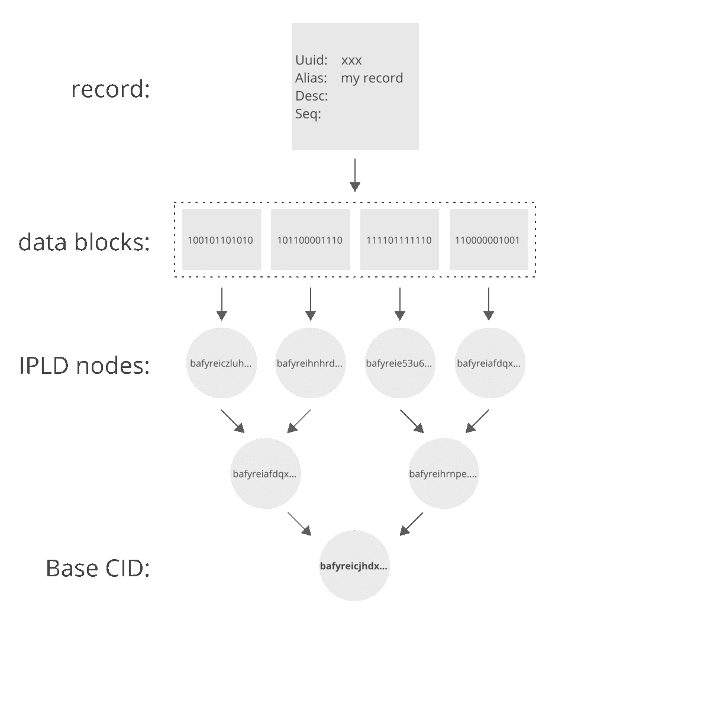
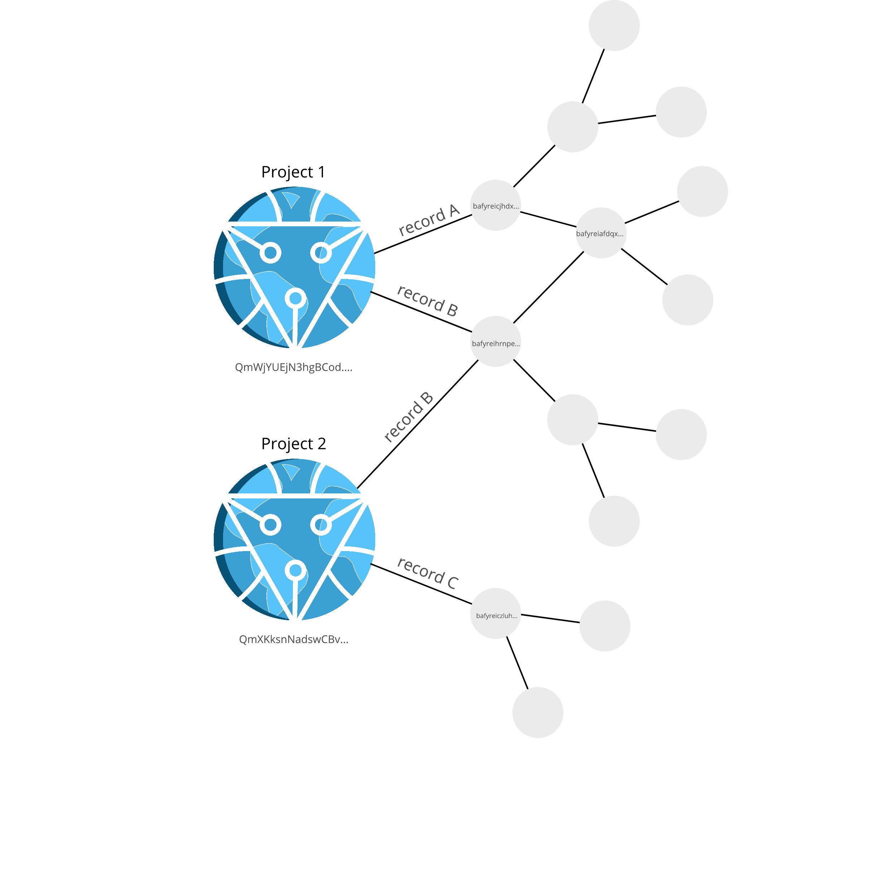

# About

`stark` is an [InterPlanetary File System](https://ipfs.io/)-backed database for recording and distributing sequencing experiments. It is both an application and a Go package for running and interacting with `stark databases`.

Features include:

- snapshot, sync and share entire databases over the IPFS
- use PubSub messaging to share and collect data records as they are created
- track record history and rollback revisions (rollback feature WIP)
- attach and sync files to records (WIP)
- encrypt record fields
- submit database snapshots to [pinata](https://pinata.cloud/) pinning service for persistence and distribution

***

## Aims

- `stark databases` can store, update and share sequencing experiments
- each sequencing experiment is documented via an updateable `record`
- a database and the contained `records` are **distributed**, **immutable** and **versioned**
    - `records` can be used by multiple databases
    - `records` can be updated but previous versions are still accessible
    - likewise, previous versions of the database can be retrieved
- a database is referenced by a `project`
    - database instances for the same `project` can communicate and pass `records`
    - a `project` is accessible if the node which produced it goes offline

## How it works

### Documenting sequencing experiments

Sequencing experiments are encoded as `records`.

>This is currently in its infancy and only basic information can be encoded.

A sequencing experiment could be a biological sample, a sequencing library or a sequencer run. The idea is that a `record` can encode any of these. We can add links between `records` to show relationships, such as multiple sequencing runs linked to a single library.

The `record` data is structured and serialised using a [protobuf](https://developers.google.com/protocol-buffers) schema. This means that `records` are **language-neutral**, **platform-neutral** and **extensible**. It also means that we can wrap the database up in a [gRPC server](https://grpc.io/docs/what-is-grpc/introduction/) and use protobuf messages to send and receive `records` to and from the database.

Some features that are currently being worked on:

* linking records to files (e.g. fast5 files)
* attaching process requests to records (e.g. basecall)

### Storing records

The heavy-lifting is done by the [InterPlanetary File System](https://ipfs.io/). Check out the [what is IPFS](https://docs.ipfs.io/concepts/what-is-ipfs) pages for more information on the concepts behind IPFS. Behind the scenes IPFS is doing the following:

- a `record` is broken into blocks, which are then formatted as [IPLD nodes](https://ipld.io/)
- each node is hashed by its contents and used to build a [Merkle DAG](https://docs.ipfs.io/concepts/merkle-dag/)
- the hash of each node is called a content identifier (`CID`)
- the `CID` of the Merkle DAG root node is used to address the whole `record`

Merkle DAGs are constructed from leaves first, i.e. child nodes are constructed before parent nodes. This makes every node in the DAG the root of a subgraph that is contained by a parent node(s). This property makes the graph immutable as a change in a leaf node will be propogated throughout the DAG and alter the base `CID`, effectively producing a new Merkle DAG. This also means that membership queries are 'cheap' and only require a few hashes to compute ([see this example with bananas](https://miro.medium.com/max/1400/0*lR_IMzUjQUJgXq5A.png) from Consensys).

Here is a simplified example of how a `record` is represented in the IPFS and how altering the `record` itself changes the base `CID` which is used to identify it:

You can see that by changing a value in the `record`, one of the underlying data blocks changes and this change propogates through the Merkle DAG as `CIDs` are updated to reflect the change in content. We now have a new base `CID` to address this new graph, which still represents our `record`.
 
However, you can also see that not all nodes in the DAG are altered. This is useful as similar `records` can share subgraphs (which is a feature which IPFS exploits to collect blocks from different sources and quickly authenticate).

### Tracking records

To track `records` in stark databases, we use a specially formatted IPFS node which uses the [unixfs data format](https://github.com/ipfs/go-unixfs/blob/master/pb/unixfs.proto) and basically serves as a directory in the IPFS. This node is the `project` node and acts as a parent node which we link `record` DAGs to.

Each link between `project` and `record` is labelled with the `CID` of the `record` and the `record` name (which is used as a database key).

For example:

The figure above shows that record A is linked to Project 1, record B is linked to both Project 1 and 2, whilst record C is linked to Project 2. Records A and B share a subgraph.

You can also see in the figure that each `project` node has a `CID` (which begins with **Qm**&). The `project` `CID` is changed when links are added or removed, or when any `records` are changed.

> & as an aside, see [here](https://proto.school/#/anatomy-of-a-cid) for more information on interpreting CIDs

This means that `stark` only needs to keep track of the `project CID`. It can use this to gather up all the links and place them in a runtime key-value store, where the key is the link name given by the user and the value is the `record CID`. By using a key-value store to track Record CIDs, the project's DAG links only need to be checked once each time the database is opened.

The `project CID` is the database `snapshot` - each time the database contents change, the `snapshot` changes. We can roll-back and fast-forward the database state using the `snapshot`.

### Sharing records

As well as sharing an entire database by giving the `CID` of the `project` node, a stark database can also communicate in real-time via the IPFS [PubSub](https://blog.ipfs.io/25-pubsub/) messaging service.

This can be used to both let others know what `records` are being added, as well as to tell one database instance to collect `records` from another producer with the same `project` name.
